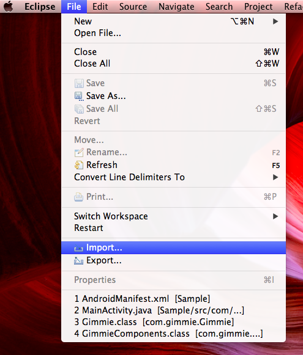
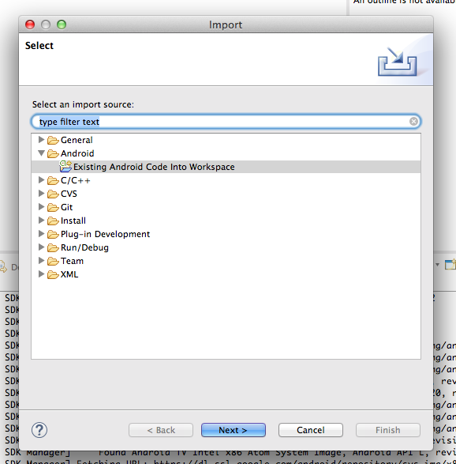
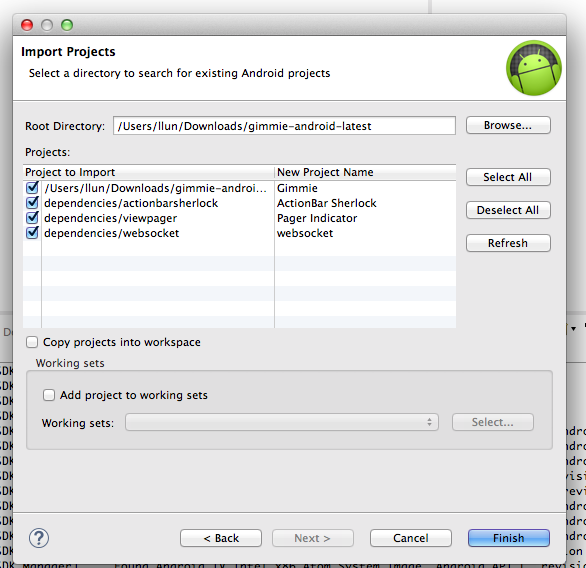
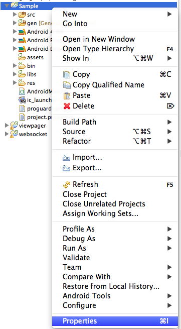
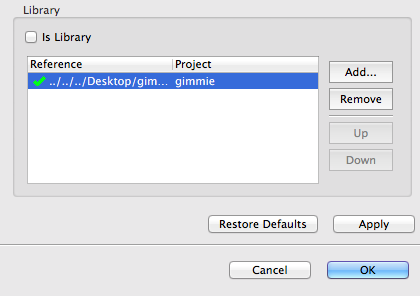

#Android SDK Quick Start

Gimmie Android SDK provides UI and API Wrapper that help you integrate Gimmie loyalty platform to your application. 
However before start with Android SDK, here is the first few steps you need to register on our portal first for getting
your key, secret that use when calling and sending information to our backend.

1. [Signup and create game on Gimmie](https://portal.gimmieworld.com/games/new)
2. Login to portal and going to __Games__, select your game and click on __Developers__ tab

## Integrate Android SDK

### Import Gimmie SDK to Eclipse

- After register your company and create your game, you can start integrate sdk by download [latest Gimmie SDK](http://gimmieworld.s3.amazonaws.com/sdk/gimmie-android-latest.zip)
- Unzip the sdk file and import all files to Eclipse by select __Import__



- Choose __Android > Existing Android code into Workspace__



- Select Gimmie sdk folder and you will see Gimmie SDK project including all dependencies that Gimmie SDK needs

 

- Click __Finish__ to finish import Gimmie SDK

### Link Gimmie SDK to your project

- Right click on your application folder and select __Properties__



- Select __Android__ and in __Library__ box click __Add__



- Select __Gimmie__ project and click __OK__
- In your __AndroidManifest.xml__ file add this permissions to allow your application connect to internet

```xml
<manifest ...>
    ...
    <uses-permission android:name="android.permission.INTERNET"/>
    <uses-permission android:name="android.permission.ACCESS_NETWORK_STATE"/>
    <uses-permission android:name="android.permission.ACCESS_WIFI_STATE" />
</manifest>
```

- And add Gimmie activity to your application

```xml
<manifest ...>
    ...
    
    <application ...>
    ...
      <activity android:name="com.gimmie.components.GimmieView" android:theme="@style/RewardCategoryPage" />
      <activity android:name="com.gimmie.components.RewardDetail" android:theme="@style/GimmieAppeaerance" />
      <activity android:name="com.gimmie.components.BadgeView" android:theme="@style/GimmieAppeaerance" />
      <activity android:name="com.gimmie.components.ClaimsList" android:theme="@style/GimmieAppeaerance" />
      <activity android:name="com.gimmie.components.HistoryList" android:theme="@style/GimmieAppeaerance" />
      <activity android:name="com.gimmie.components.WebView" android:theme="@style/GimmieAppeaerance" />
    
    </application>
</manifest>
```

- In addition to UI Gimmie also needs key and secret from above when you create a game. Add the infromation in application here.

```xml
<manifest ...>
    ...
    
    <application ...>
      <meta-data android:name="com.gimmie.api.key" android:value="your_game_key_from_portal" />
      <meta-data android:name="com.gimmie.api.secret" android:value="your_game_secret_from_portal" />
    </application>

</manifest>
```

- That's all

For more information, you can visit [API Docs](http://developer.gimmieworld.com/documentation/android/reference/packages.html) for more detail information.
