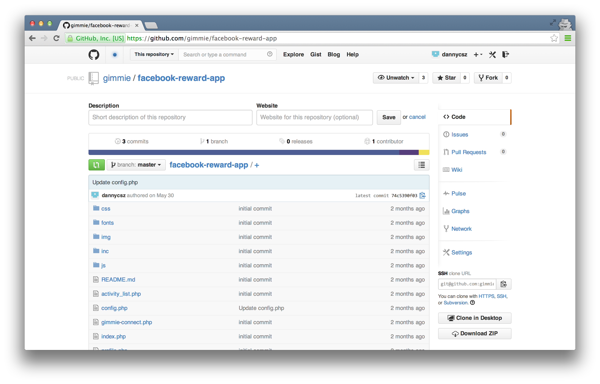
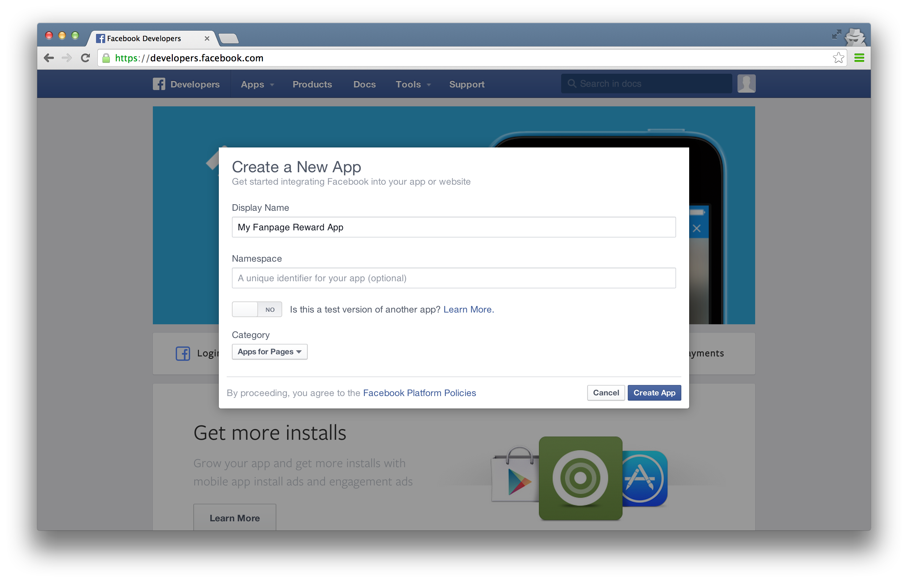
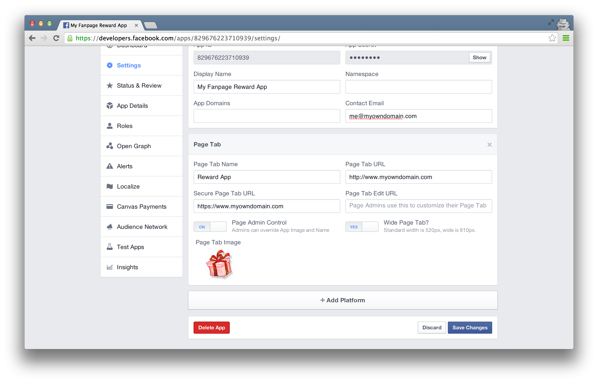
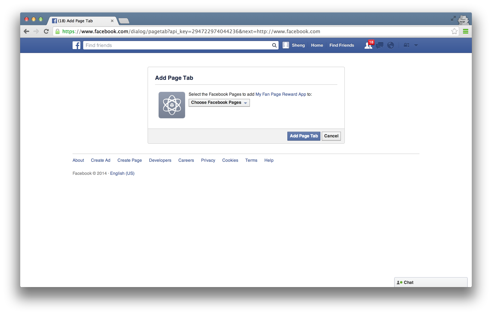

# Facebook Reward App quickstart

Gimmie Reward App for Facebook provides a reward program for your Facebook Fan page. The app includes events that you can configure in [Gimmie portal](https://portal.gimmieworld.com) to give out points or instant rewards.

Here are the events included in app currently:

- __refer_a_friend__, This event is called when user share your fanpage reward program link to friends and their friend join the reward program on your fanpage.
- __fanpage_like__, This event is called when user like your fanpage.

## Installation

You will need PHP web hosting that has SSL and developer knowledge for the installation. Here are the steps to install Facebook Reward App on your Fanpage.

- Get the fanpage reward app files from [Github](https://github.com/gimmie/facebook-reward-app)

- Go to [Facebook Developers](https://developers.facebook.com/) and click __Create a New App__ under __Apps__.

- Give the app a name and choose __Apps for Pages__ for Category.

- Click on __Settings__ and click __Add Platform__

- Choose __Page Tab__, fill in Contact Email and Page Tab Name. Enter the URL of your fanpage reward app you going to upload to, ensure trailing slash (e.g. http://www.myowndomain.com/, http://www.myowndomain.com/facebook/ ) for Page Tab URL and Secure Page Tab URL. Upload a Page Tab Image (111px x 74px) for the Page Tab icon. Click Save.

- Click on __Status & Review__, toggle "available to the general public" to YES

- Create a Facebook Platform Game and complete the registration in [Gimmie Portal](https://portal.gimmieworld.com/games/new)

- Open __config.php__ file with your favourite text editor, update config file with the Game Key and Secret found in Gimmie Portal after creating the Game, also update Facebook App ID and Secret found on the Facebook App.

- Upload all the fanpage reward app files to your server that point to the domain you set for your Page Tab URL earlier.

- Add the new app to your fan page by going to https://www.facebook.com/dialog/pagetab?api_key=__FACEBOOK_APP_ID___&next=http://www.facebook.com. Replace __FACEBOOK_APP_ID___ with the app you create earlier. You should see the app for your option. Select it and click __Add Page Tab__

