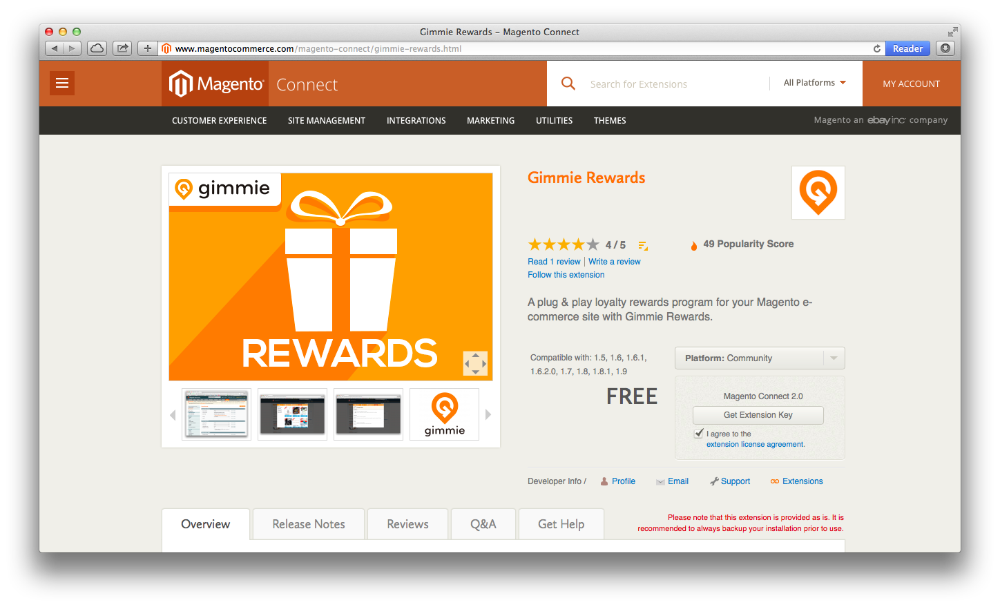
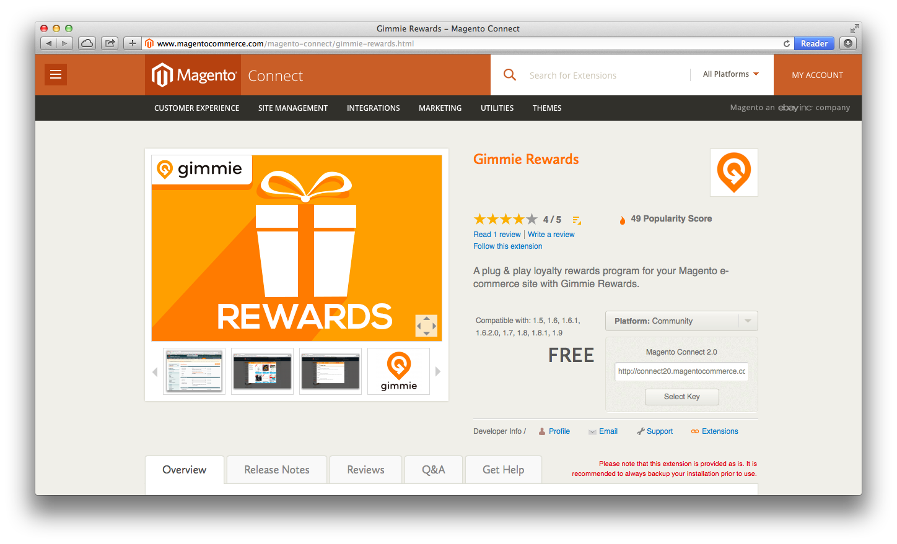
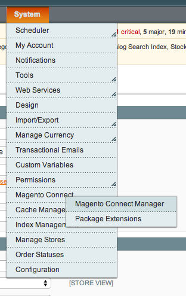
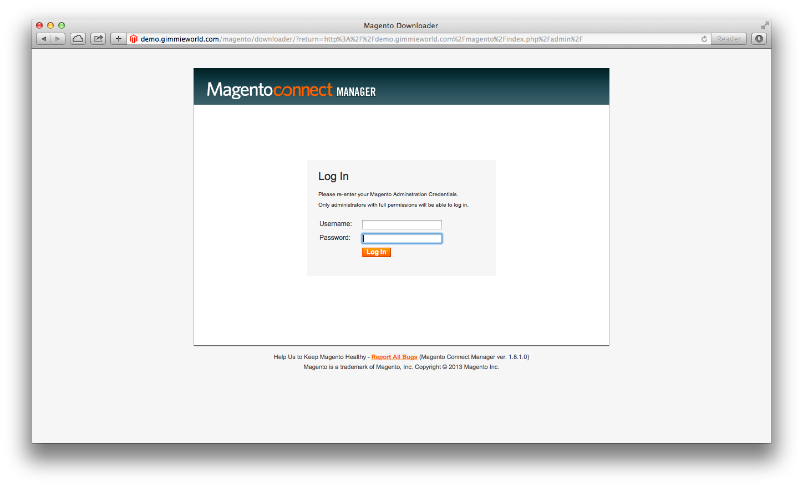
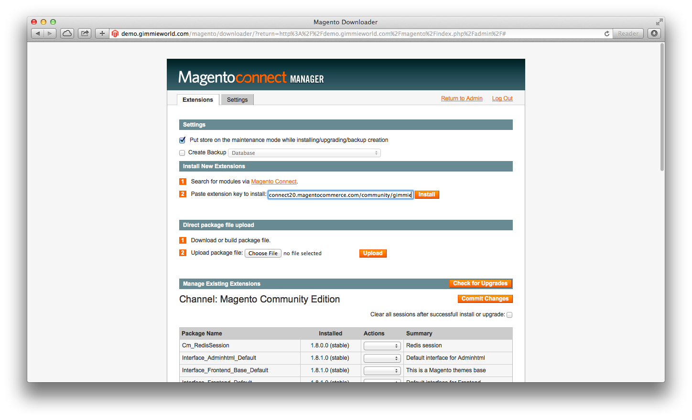
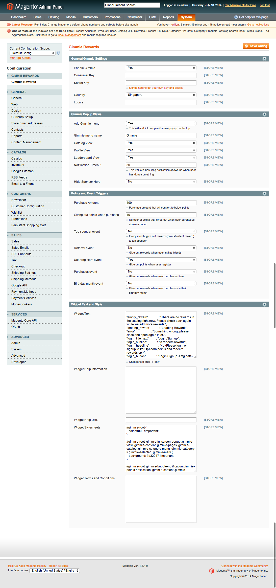

# Magento quickstart

Gimmie plugin for Magento provides gamifications tool for your ecommerce site. The plugin includes events that you can configure in [Gimmie portal](https://portal.gimmieworld.com) for give out points or instant rewards. 

Here is events include in plugin currently, you can create it manually in portal or wait when someone done it it your site to create automatically with __do nothing__ action.

- __magento_refer_a_friend__, This event is called when user share your website link to friends and their friend click on the link and register to your ecommece site. The user who share the link will get the points or actions as you configure in the portal.
- __magento_register_user__, This event is called when user is success register to your ecommerce site.
- __magento_purchase_item__, This event is called when user purchases item from your ecommerce site.
- __magento_purchase_item_in_birthday_month__, This event is called when user purchases item in their birthday month.
- __magento_top_spender_of_the_month__, This event is called in the first day of next month on the user who purchases the most.

## Installation

Gimmie plugin is available in Magento Commerce site. Here are steps to install Magento plugin.

- Get the plugin from [Magento commerce](http://www.magentocommerce.com/magento-connect/gimmie-rewards.html)

- Click on __Install Now__ and check on __I agree to the extension license agreement__ and Click on __Get Extension Key__

- Copy the url from text box for using in your Magento site.

- Login to your Magento admin page

- Go to __System > Magento Connect > Magento Connect Manager__

- Login again with your admin username and password

- Paste the URL from step 3 to textfield under __Install New Extensions__ section and click __Install__

- Go back to Magento Admin page and go to __System > Configuration__

- Gimmie Configuration is in the first menu on the left and here are options that you can configure Gimmie.

