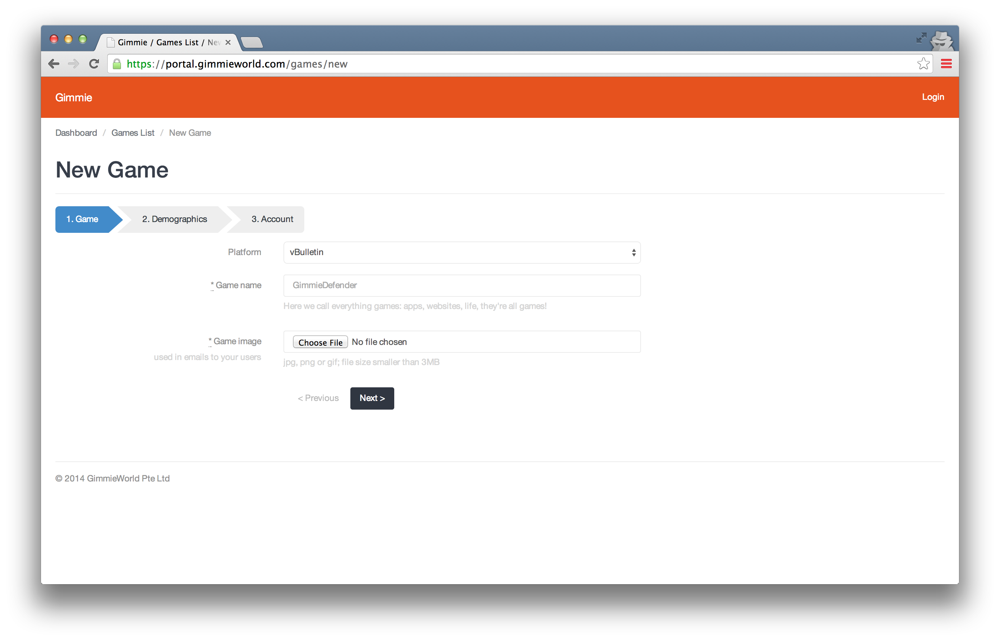

# vBulletin quickstart

Gimmie Reward for vBulletin provides a reward program for your vBulletin. The plugin includes events that you can configure in [Gimmie portal](https://portal.gimmieworld.com) to give out points or instant rewards.

Here are the events included currently:

- __login_site__, This event is called when user login to site
- __create_poll__, This event is called when user create a poll.
- __create_post__, This event is called when user create a post.
- __rate_thread__, This event is called when user rate a thread.
- __received_thread_rating__, This event is called when use thread receive a rating.
- __refer_a_friend__, This event is called when user refer a friend and the friend sign up.
- __create_thread__, This event is called when user create a thread.
- __vote_poll__, This event is called when user vote on a poll.

## Installation

This plugin is only applicable for vBulletin v4 and below. You will need vBulletin hosting that allow plugin installation. Some basic vBulletin and developer knowledge will be useful for the installation. Here are the steps to install Gimmie Reward for vBulletin plugin.

- Get the plugin file from [Github](https://github.com/gimmie/vbulletin-v4)


- Extract the file and upload everything in the __/upload__ folder to the root folder of your vbulletin forum.

- Create a vBulletin Game and complete the registration in [Gimmie Portal](https://portal.gimmieworld.com/games/new)



- From your vbulletin Control Panel, go to Plugins & Products -> Manage Products -> Add/Import Product and put ./XML/product_gimmie.xml in the "OR import the XML file from your server" box and click


- From your vBulletin Control Panel, go to -> Settings -> Options

- Click "Edit Settings" for Gimmie Loyalty Program Setting

- Fill in the __Gimmie KEY__ and __Gimmie Secret__ with the Game Key and Secret found in Gimmie Portal after creating the Game and update the option accordingly


## Add reward catalog link to your vbulletin

 - To add the Rewards button, Search ```ul id="navtabs"``` under Styles & Templates > Search in Template. 

 - Click on "navbar" file. Find ```<ul id="navtabs" class="navtabs ....``` in the Template field, add ```<li><a href="javascript:;" gm-view="catalog" class="navtab"><span>Rewards</span></a></li>``` just above the ```</ul>```

 e.g.

 ```
 <ul id="navtabs" class="navtabs floatcontainer<vb:if condition="$show['member'] AND $notifications_total"> notify</vb:if>">
 		{vb:raw template_hook.navtab_start}
 		{vb:raw navigation}
 		{vb:raw template_hook.navtab_end}
     <li><a href="javascript:;" gm-view="catalog" class="navtab"><span>Rewards</span></a></li>
 </ul>
 ```
 
 - To add user points beside Username, Search << li class="welcomelink" >> under Styles & Templates > Search in Template. 

 Click on "header" file. Find ``` li class="welcomelink" ``` in the Template field, add ``` <span gm-view="profile" style="cursor:pointer;font-weight:bold;">(<span class="gimmie-user-points">...</span> points)</span> ``` just above the ```</li>```

 e.g. 

 ```
  <li class="welcomelink">{vb:rawphrase welcome_x_link_y, {vb:raw bbuserinfo.username}, {vb:link member, {vb:raw bbuserinfo}}} <span gm-view="profile" style="cursor:pointer;font-weight:bold;">(<span class="gimmie-user-points">...</span> points) </span> </li>
 ```
 